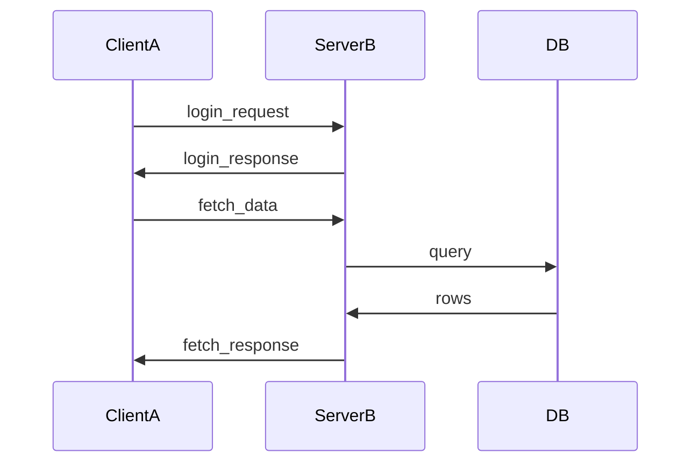

# sd Cheat Sheet

## Overview

`sd` は、Rust 製の検索・置換 CLI で、`sed` の代替として作られています。`sed` のような覚えにくいフラグの組み合わせ（`-e`, `\1`, デリミタのエスケープなど）を避け、直感的な構文で正規表現置換ができるのが特徴です。実務ではログの整形、コードの一括置換、テキスト変換パイプラインの構築に向いています。

## When to Use

- `sed` の構文（`\1` によるキャプチャ参照やデリミタのエスケープ）を毎回調べるのが面倒なとき
- ファイルを直接、あるいはパイプライン経由で一括置換したいとき
- ログなど定型フォーマットのテキストを、別の形式（Markdown, Mermaid など）に変換したいとき

## Basic Syntax

```bash
sd [OPTIONS] <FIND> <REPLACE_WITH> [FILES...]
```

`FILES` を指定すると対象ファイルを **in-place（直接）書き換え**ます。`FILES` を省略すると標準入力を読み取り、標準出力へ結果を書き出す「フィルタ」として動作します（元ファイルは変更されません）。

## Common Examples

```bash
# 標準入力を置換して標準出力へ（ファイルは変更しない）
echo "hello world" | sd "world" "sd"

# ファイルを直接書き換える（in-place、バックアップは作られない）
sd "foo" "bar" file.txt

# 正規表現でマッチした部分をキャプチャして使う（sed の \1 ではなく $1 $2 ...）
echo "yoshi@example.com" | sd '(\w+)@(\w+)\.com' '$1 at $2 dot com'
# => yoshi at example dot com

# 完全な文字列（リテラル）として置換する（正規表現の特殊文字をエスケープ不要）
sd -F '1.0.0' '1.0.1' package.json

# 変更内容をプレビューする（ファイルは書き換えない）
sd -p 'foo' 'bar' file.txt
```

## 実例: ログから Mermaid シーケンス図（Markdown）を生成する

`access.log`（変換前）:

```text
2026-08-15 10:00:01 ClientA -> ServerB: login_request
2026-08-15 10:00:02 ServerB -> ClientA: login_response
2026-08-15 10:00:03 ClientA -> ServerB: fetch_data
2026-08-15 10:00:04 ServerB -> DB: query
2026-08-15 10:00:05 DB -> ServerB: rows
2026-08-15 10:00:06 ServerB -> ClientA: fetch_response
```

日時・矢印・コロン区切りのログ行を、キャプチャグループで Mermaid のシーケンス図記法（`A->>B: message`）に変換し、コードフェンスで囲んで Markdown に仕立てます。

```bash
{
  echo '```mermaid'
  echo 'sequenceDiagram'
  sd '^\d{4}-\d{2}-\d{2} \d{2}:\d{2}:\d{2} (\w+) -> (\w+): (.+)$' '    $1->>$2: $3' < access.log
  echo '```'
} > diagram.md
```

`diagram.md`（変換後）:

````text

````

このように `sd` はファイルを直接書き換えるだけでなく、標準入出力のフィルタとして使うことで「ログ → 別フォーマットへの変換」パイプラインの1ステップとしても使えます（今回は `<` でログを読み込み、前後に Mermaid のコードフェンスを足しているだけで、ログの中身自体は `sd` の正規表現置換だけで変換しています）。

## Frequently Used Options

```bash
# 大文字小文字を無視して置換
sd -f i 'error' 'ERROR' log.txt

# 複数のファイルをまとめて置換
sd 'old_name' 'new_name' src/*.ts

# 置換回数を1ファイルあたり1回に制限
sd -n 1 'TODO' 'DONE' notes.txt

# . を改行にもマッチさせる（複数行にまたがるパターン向け）
sd -f s '<!--.*-->' '' page.html

# 単語単位でマッチ（部分一致を避ける。例: "id" で "uuid" にヒットさせない）
sd -f w 'id' 'uuid' schema.sql

# フラグは組み合わせられる（大文字小文字無視 + 複数行）
sd -f im '^error' '[ERROR]' log.txt
```

## Notes

- `sd` はデフォルトで正規表現マッチです。`sed` の `\1` と違い、キャプチャグループの参照は `$1` `$2` ... という書式です。
- ファイル引数を渡すとその場で in-place 書き換えが行われ、`sed -i.bak` のような自動バックアップは作られません。大きな変更をする前は git などで退避しておくと安心です。
- ファイル引数を省略すると標準入力を読み標準出力へ書き出す「フィルタ」として動作します。元ファイルを保持したまま別ファイルへ変換結果を出したい場合はこちらを使います（本ページの Mermaid 変換例もこの方式です）。
- 内部的に Rust の `regex` クレートを使っているため、[正規表現のNotes](../formats/regex.md)にある通り先読み・後読み（lookaround）は使えません。複雑な文脈依存の置換が必要な場合は Perl や Python への切り替えを検討してください。
- `-F`（リテラルモード）は、置換したい文字列自体に `.`や`(`など正規表現の特殊文字が含まれる場合（バージョン番号やファイルパスなど）に便利です。

## Related Links

- Download: https://github.com/chmln/sd/releases
- Install: https://github.com/chmln/sd#installation
- Docs: https://github.com/chmln/sd#usage
- License: https://github.com/chmln/sd/blob/master/LICENSE
